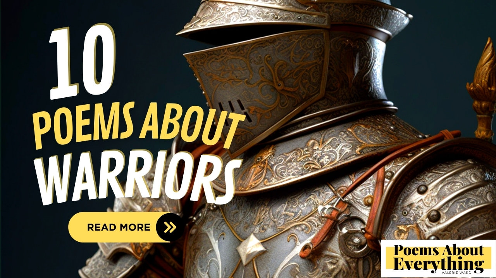

Warriors are respected and powerful individuals often associated with courage, strength, and honor. Throughout history, the warrior represents a way of life that involves discipline, sacrifice, and the pursuit of excellence. The warrior also embodies the idea of protection, as they're often tasked with defending their country against external threats.

> The warrior stands tall,  
> His sword gleaming in the light,  
> Ready for battle.

## 10 Poems About A Warrior
------------------------

Warriors symbolize the struggle against adversity, as they must overcome obstacles and challenges in order to achieve their goals. Below you will find ten poems about a warrior with each one focusing on an attribute they embody.

### A Poem about a Warrior's Courage
--------------------------------

A warrior is brave and willing to face danger, even in the face of fear.

> A warrior, with sword in hand,  
> He stands so tall, so brave and grand,  
> With armor strong, and heart so pure,  
> He faces danger, with courage sure.
> 
> He hears the call, of battle cry,  
> And fear within, he does not deny,  
> For he knows, what he must do,  
> To protect his people, and see them through.
> 
> With every step, and every breath,  
> He fights with valor, and with strength,  
> And though his heart may fill with dread,  
> He faces his foe, without a shred of regret.
> 
> For he is a warrior who will never fold,  
> A defender of truth, a fighter so bold,  
> And in the face of danger, he shall not yield,  
> For he knows that courage, is the only shield.
> 
> And when the battle is done, and the war is won,  
> He stands victorious, under the setting sun,  
> A warrior, with a heart of gold,  
> Whose courage, will forever be told.

### A Poem about a Warrior's Strength
---------------------------------

Physical strength and endurance are important for a warrior, as they often engage in physically demanding activities.

> With muscles rippling, and sinews taut,  
> The warrior stands, in battle wrought,  
> His strength is legend, his might renowned,  
> And foes tremble, at the mere sound.
> 
> For he is a warrior, strong and true,  
> His body honed, for what he must do,  
> He lifts his sword, with power and grace,  
> And charges forth, to meet his fate.
> 
> Through miles of trekking, and battles fought,  
> His endurance, never once is caught,  
> For he is a warrior, built to last,  
> His strength and stamina, unsurpassed.
> 
> And when the day is done, and the night is near,  
> The warrior rests, without any fear,  
> For he knows, that with each passing day,  
> His strength grows stronger, in every way.
> 
> So let us honor, the warrior's might,  
> His physical strength, a wondrous sight,  
> For in his body, we see the power,  
> Of a warrior, whose strength will never cower.

### A Poem about a Warrior's Discipline
-----------------------------------

A warrior must be disciplined in their training and lifestyle, adhering to a strict code of conduct.

> With every step, and every move,  
> The warrior practices, and improves,  
> For discipline, is what he knows,  
> And it's what makes, his spirit glow.
> 
> He rises early, before the dawn,  
> And greets the day, with a warrior's song,  
> He trains his body, and his mind,  
> To be prepared, for what he'll find.
> 
> He lives a life, of strict routine,  
> And follows rules, that others may deem,  
> Too hard to follow, or too strict,  
> But for the warrior, it's just the trick.
> 
> For discipline, is what he needs,  
> To be prepared, for future deeds,  
> To face the challenges, that lie ahead,  
> And not be swayed, by fear or dread.
> 
> And when he faces, the battle call,  
> He stands tall, and proud and tall,  
> For his discipline, has made him strong,  
> And in his heart, he knows he belongs.
> 
> So let us learn, from the warrior's way,  
> And practice discipline, day by day,  
> For in its grip, we'll find the power,  
> To be like warriors, hour by hour.

### A Poem about a Warrior's Focus
------------------------------

The ability to maintain concentration and stay focused on the task at hand is crucial for a warrior.

> With eyes that blaze, with fierce intent,  
> The warrior stands, both firm and bent,  
> His mind is focused, like a laser beam,  
> On the goal ahead, and the battle's scheme.
> 
> He shuts out all distractions, and noise,  
> And listens only, to his inner voice,  
> For his focus, is what sets him apart,  
> And gives him strength, to conquer the heart.
> 
> Through the heat of battle, and the chaos of war,  
> The warrior remains, forever more,  
> Focused on the mission, and the end goal,  
> And let's nothing, deter his soul.
> 
> For he knows, that in focus lies,  
> The power to win, and the ability to rise,  
> Above the fray, and the noise of the fight,  
> And emerge victorious, with all his might.
> 
> So let us learn, from the warrior's way,  
> And cultivate focus, day by day,  
> For in its grip, we'll find the power,  
> To overcome challenges, hour by hour.

### A Poem about a Warrior's Perseverance
-------------------------------------

A warrior must be able to overcome obstacles and persist in the face of adversity.

> With every step, and every breath,  
> The warrior presses on, in the face of death,  
> His perseverance, a shining light,  
> That guides him through, the darkest night.
> 
> Through battles fought, and wounds sustained,  
> The warrior endures, through the pain,  
> For he knows, that with each passing day,  
> His perseverance, will pave the way.
> 
> For victory, and for glory,  
> And though his journey, may be gory,  
> He never wavers, he never bends,  
> For his perseverance, has no end.
> 
> Through the storms of life, and the trials of war,  
> The warrior persists, forevermore,  
> With his heart full, of unbreakable steel,  
> And his soul filled, with an unshakable zeal.
> 
> So let us honor, the warrior's might,  
> His perseverance, a wondrous sight,  
> For in his spirit, we see the power,  
> Of a warrior, whose will shall never cower.

### A Poem about a Warrior's Honor
------------------------------

A warrior has a strong sense of personal honor and integrity and always acts in accordance with their values.

> A warrior's honor burns bright and true,  
> Guiding every step they take,  
> A flame that blazes through and through,  
> A vow they never break.
> 
> Their heart is pure, their spirit strong,  
> Their soul a shining light,  
> For right and truth they will fight long,  
> And never yield in fright.
> 
> They stand tall with their head held high,  
> And face their foes with grace,  
> With courage that will never die,  
> And dignity in every place.
> 
> For they have sworn to defend the weak,  
> And protect the innocent,  
> To never falter, never seek,  
> To take the easy descent.
> 
> So let us honor the warrior's creed,  
> And hold their valor high,  
> For in their hearts they plant the seed,  
> Of justice that will never die.

### A Poem about a Warrior's Loyalty
--------------------------------

A warrior is loyal to their comrades and leaders, and will always put the needs of their team above their own.

> A warrior's loyalty runs deep and strong,  
> A bond that cannot be broken by time or tide,  
> Their heart beats true, never to do wrong,  
> For their comrades, they will stand and abide.
> 
> They march forward with their heads held high,  
> Shoulders back, their spirits strong,  
> And never waver, never shy,  
> For they know where they belong.
> 
> Their comrades are their family,  
> Their brothers and sisters in arms,  
> A bond forged in camaraderie,  
> And strengthened by battle's alarms.
> 
> They will never leave a comrade behind,  
> Nor let a leader fall alone,  
> For in their loyalty, they find,  
> A strength that will forever be shown.
> 
> So let us honor the warrior's loyalty,  
> For it is a priceless treasure,  
> A bond that will never see a degree,  
> For it is born of love and pleasure.

### A Poem about a Warrior's Respect
--------------------------------

A warrior respects their opponents, as well as their own abilities and limitations.

> With armor strong and sword in hand,  
> The warrior stands, prepared to defend.  
> But though they fight with might and skill,  
> Their heart with respect is always filled.
> 
> For every foe they face with grace,  
> Acknowledging their skill and place.  
> With honor shown in every move,  
> A battle fought with a noble groove.
> 
> And even in the heat of war,  
> The warrior holds a steadfast core.  
> For they know their own limits too,  
> And don't take on what they can't pursue.
> 
> With humility and bravery,  
> Their actions speak of dignity.  
> And in this way they earn the trust,  
> Of allies and foes alike, they must.
> 
> For respect is not a thing bestowed,  
> But earned with every step and blow.  
> And so the warrior walks with pride,  
> A shining example to abide.
> 
> For though they fight with all their might,  
> Their respect shines a greater light.  
> A true warrior in every sense,  
> A model of honor and defense.

### A Poem about a Warrior's Adaptability
-------------------------------------

A warrior must be able to adapt to changing situations and make quick decisions in unpredictable environments.

> In battle's fray, the warrior stands,  
> With blade in hand, and heart so grand,  
> He faces foes with steely gaze,  
> And with each move, he adapts his ways.
> 
> No foe can catch him unawares,  
> For he is quick to change his snares,  
> And though his plans may be upturned,  
> He always finds a way to learn.
> 
> He shifts his stance, and changes gear,  
> To overcome each new frontier,  
> And when his enemies attack,  
> He knows just how to counteract.
> 
> For though his path may twist and turn,  
> And though his foes may rage and burn,  
> The warrior knows how to survive,  
> By being flexible, and staying alive.
> 
> And when the fight is won at last,  
> And peace descends upon the land so vast,  
> The warrior's adaptability,  
> Is hailed as a great ability.
> 
> For in a world that's ever-changing,  
> The warrior's skill is unchanging,  
> And though he faces constant strife,  
> He adapts and thrives throughout his life.

### A Poem about a Warrior's Sacrifice
----------------------------------

A warrior is willing to make personal sacrifices for the greater good, whether that means risking their own safety or putting the needs of others before their own.

> A warrior's sacrifice is not just a choice,  
> But a duty that calls with a resounding voice,  
> To defend what's right, and stand for the weak,  
> To fight for justice, and the truth to seek.
> 
> In battles fierce, with sword in hand,  
> The warrior charges, ready to withstand,  
> The onslaught of foes, and the pain they bring,  
> With courage and strength, like a mighty king.
> 
> But the greatest sacrifice the warrior makes,  
> Is not just in battles, where their life's at stake,  
> It's in the moments when they choose to serve,  
> To put others first, and their own needs preserve.
> 
> They offer their time, their skills, and their heart,  
> To those in need, who are torn apart,  
> By war, by famine, by suffering and pain,  
> The warrior steps in, and brings hope again.
> 
> Their sacrifice is not just in the act,  
> But in the selflessness they show in fact,  
> To give of themselves, without a second thought,  
> To lift others up, and help them to stand tall.
> 
> So let us honor the warrior's sacrifice,  
> And remember their deeds, like a precious prize,  
> For they remind us that true greatness lies,  
> In serving others, with all our might.

### The Warrior's Call (to Action)
------------------------------

A warrior doesn't have to be all about brute strength either! They must have a strong mindset and unwavering determination. [This is something](https://jamieschwandt.medium.com/man-up-11-ways-to-become-a-warrior-940e0c024caf) each of us can practice in our day-to-day.

**5 tips for having a warrior's mindset:**

1.  Start by setting clear goals
2.  Embrace challenges and failures as opportunities to grow
3.  Practice self-discipline
4.  Push yourself to be your best self.
5.  Remember that being a warrior is not just about winning battles, but about facing life's challenges with courage and grace.

I hope these poems about a warrior encourage you in your everyday life. (affiliate link) [Here is my favorite book to help you think like a warrior](https://amzn.to/3GPLqGG)!