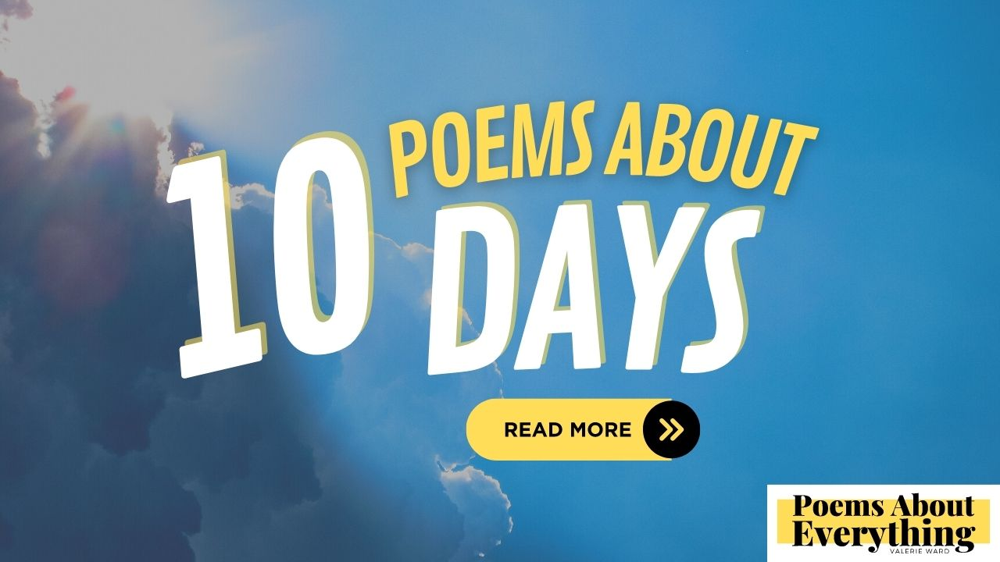

As I get older I find myself reflecting on the importance of each day and the passage of time.  With each sunrise, we have an opportunity for a fresh start with a blank canvas.  What will you do with your limited time today?

It's so easy to take a day for granted, but our days are delicate and something to be cherished.  Each day holds an immeasurable value that writing poems about days would be an eternal task.

Today, and every other day, constructs our lives, shapes our human experience, and brings growth and fulfillment.  However, some days bring the opposite.  During these times, we are reminded of how each day is a gift.

## 10 Poems About Days
-------------------

On this day, I've gathered some of my favorite poems about days to share with you.

### Sunday's Sonnet
---------------

Since I was a child my parents instilled in me about how Sunday is a day of rest.  Starting off your week with rest and solace prepares your mind and body for the days ahead.  Never underestimate the power of rest.

> O Sunday, herald of a tranquil rest,  
> A day of solace for the weary soul,  
> When cares of the world find a moment's jest,  
> And peace and stillness finally take control.
> 
> Amidst the chaos of the days gone by,  
> You beckon us to pause, to breathe, to be,  
> A respite from the toil, a gentle sigh,  
> A chance to find the calm that sets us free.
> 
> With open arms, you cradle our fatigue,  
> And offer solace in your tender sway,  
> A sanctuary where worries find intrigue,  
> And burdens gently lift, if just for a day.
> 
> O Sunday, blessed day of sweet reprieve,  
> In your embrace, our weary hearts retrieve.

### A case of the Mondays
----------------------

Have you ever started off your day perfectly with plenty of rest and a good breakfast only to be blindsided with "a case of the Mondays"?  I know I have!  During these trying times, try to focus on the shortness of it, press forward, and get to the next day.

> In the land of weekdays, a tale is told,  
> Of Mondays, notorious for their heavy hold.  
> A burden they bear, a weight hard to sway,  
> Yet we rise and face them, come what may.
> 
> With groggy eyes and minds still half-asleep,  
> We trudge through the morning rush, in a weary heap.  
> But within the Monday blues, a spark remains,  
> A chance to start anew, despite the strains.
> 
> So let's conquer Mondays, with spirits bright,  
> Embrace the challenge, and greet the day with might.  
> For in each week's start, lies untapped bliss,  
> A chance to soar, amidst the Monday abyss.

### Victorious Tuesday
-------------------

Did you know that Tuesday is named "Tiw" the god of war?  It is also the most productive day of the week for many people.  Because of this, I try to focus on the small victories in life on this day.  Each and every small event is added together to become to sum total of everything.  This becomes your life story.

> On Tuesday's stage, a humble scene unfurls,  
> A canvas where small victories softly twirls.  
> Amidst the week's journey, it takes its place,  
> With a gentle grace, a quiet embrace.
> 
> In morning's light, we face the tasks at hand,  
> A chance to conquer, to make our stand.  
> Each step we take, a small triumph indeed,  
> Building momentum with every noble deed.
> 
> A smile shared, a thoughtful word expressed,  
> The simple joys in life, we manifest.  
> In every gesture, a victory we find,  
> A ripple of kindness, leaving none behind.
> 
> Through hours that pass, challenges may arise,  
> Yet hope persists, unveiling its surprise.  
> For in the midst of daily toil and strain,  
> We find small triumphs, easing any pain.
> 
> A problem solved, a goal finally met,  
> A tender moment we will not forget.  
> With every hurdle leapt and obstacle crossed,  
> We savor the victories, no matter the cost.
> 
> Tuesday whispers secrets of hidden glee,  
> Inviting us to cherish what will be.  
> For in these moments, grand or seemingly small,  
> We gather strength, standing tall, standing tall.
> 
> So let us find joy in the Tuesday's embrace,  
> In every triumph, big or small in space.  
> For with each victory, our spirits rise,  
> And Tuesday's blessings, we'll forever prize.

### Wednesday is hump-day!
----------------------

Sometimes it's nice to know we've made it to the halfway point and it's all downhill from here. The comfort we get when each crossing the middle makes every day a little bit easier.

> Midweek arrives, hump-day in sight,  
> The summit conquered, bathed in twilight.  
> Downhill we tread, the weekend draws near,  
> In dreams and hopes, its essence we steer.
> 
> Wednesday's presence, a moment to reflect,  
> The climb behind us, struggles we deflect.  
> As we descend, with spirits aglow,  
> Adventure awaits, where memories will sow.
> 
> So let us cherish this downward glide,  
> Through valleys of joy, with hearts open wide.  
> Wednesday, the gateway to dreams untold,  
> Where the downhill journey reveals life's gold.

### The Good in Mundane Thursday
-----------------------------

Of all my poems about days, writing about Thursday is the hardest.  Thursday to me is mundane and ordinary which is actually something I value more as I get older.  I'm trying not to get caught up in the drama of life anymore.  Yes, there are things worth fighting for, but it's comforting knowing that today just "is".

> In the realm of days, Thursday stands so plain,  
> An emblem of the mundane, unadorned terrain.  
> Yet hidden beneath its unassuming facade,  
> Lies a subtle solace, a calmness applaud.
> 
> Thursday, the quiet harbinger of respite,  
> Whispering serenity with its tranquil light.  
> No grand fanfare or extravagant parade,  
> Just ordinary moments, in simplicity arrayed.
> 
> No tumultuous dramas or chaotic scenes,  
> No frantic rush, no uproarious routines.  
> A gentle rhythm in the pulse of the day,  
> Thursday offers solace in its own modest way.
> 
> The sun, unhurried, paints the sky serene,  
> As if even nature craves a tranquil scene.  
> The world slows its pace, sighing in relief,  
> Embracing the solace, seeking sweet reprieve.
> 
> No battles to fight, no burdens to bear,  
> Thursday grants us freedom from life's weary glare.  
> In this oasis of calm, we find sanctuary,  
> In the stillness of moments, where we are truly free.
> 
> The humdrum of Thursday may seem plain,  
> Yet it gifts us respite from chaos and strain.  
> In the ordinary, we discover our peace,  
> The quietude within that lets our worries cease.
> 
> So let us savor these unassuming days,  
> Find beauty in simplicity's gentle embrace.  
> For Thursday's unadorned, mundane display,  
> Teaches us that even the ordinary holds sway.
> 
> In the absence of stress, we find our release,  
> A chance to breathe, to find our inner peace.  
> Thursday, mundane and unpretentiously mild,  
> We welcome you gladly, as a precious respite.

### Friday's Possibilities Abound
-----------------------------

Still to this day, I look forward to Friday.  When I was a child it marked the end of my studies.  When I worked it marked the end of labor and a paycheck to boot.  Now it marks a time to see my grandchildren.  While many of my poems about days delve into reflection, Friday is a day to look forward to life's possibilities.  

> Friday, the gateway to dreams unfurled,  
> A bridge connecting worlds, a precious pearl.  
> The last day of toil, a laborer's release,  
> Opening the doors to joy and inner peace.
> 
> A symphony of anticipation ignites the air,  
> As the week bids farewell, shedding its wear.  
> Friday, a chorus of whispers and cheers,  
> An anthem of freedom that echoes in our ears.
> 
> The weight of responsibility begins to fade,  
> Replaced by a sense of liberation cascading like a cascade.  
> No more deadlines, no more meetings to attend,  
> Friday beckons, promising a respite to mend.
> 
> A canvas of possibilities unfurls before our eyes,  
> An invitation to explore the weekend's guise.  
> To focus on ourselves, to find rejuvenation,  
> To revel in laughter, friendship, and elation.
> 
> With each passing hour, the excitement grows,  
> The countdown to freedom, the day overflows.  
> Plans take shape, an agenda born anew,  
> Friday, the conductor of adventures so true.
> 
> In the realm of Friday, worries take flight,  
> As we immerse ourselves in pure delight.  
> Laughter echoes through streets and corridors,  
> A celebration of life, where happiness soars.
> 
> The weekend dances with endless glee,  
> Unveiling the wonders it holds, setting us free.  
> Friday, the catalyst, the ignition to explore,  
> To immerse in passions we've yearned for.
> 
> So let us welcome this day, with open arms,  
> Savoring the magic, unearthing its charms.  
> Friday, the junction of work and play,  
> A precious gift, igniting our soul's array.

### Memory Making Saturdays
-----------------------

Growing up Saturday was always a day to spend with family and friends.  It accounts for so many of my fondest memories from going to sporting events with my father, attending live plays with my mother, game day with my kids, [traveling with friends](./poems-about-walking.md), and now bonding time with grandkids.

> In moments cherished, memories take flight,  
> Across a spectrum of joy, shining bright,  
> From laughter and tears,  
> Throughout all the years,  
> A tapestry of moments, memories ignite.
> 
> From sporting events, adrenaline's embrace,  
> To live plays, where stories find their space,  
> With family and friends,  
> The love never ends,  
> Saturdays bring memories we eagerly chase.
> 
> Game days with children, their spirits soar,  
> Creating bonds that forever will endure,  
> In jerseys and cheers,  
> Through victories and tears,  
> Memories woven in threads, strong and pure.
> 
> Travels with dear friends, the world we roam,  
> Exploring new horizons, we freely comb,  
> Adventures untold,  
> Memories of gold,  
> Saturdays painting stories as we roam.
> 
> And now, with grandkids, a new chapter begins,  
> A legacy of love, where happiness wins,  
> Through stories and play,  
> Each Saturday, we sway,  
> Memories blooming like wildflowers in bins.
> 
> For in the tapestry of life's grand design,  
> Saturdays hold treasures, memories entwined,  
> From the wide array,  
> Of moments we sway,  
> Memories that matter, forever align.

### A Day on Top
------------

Some days everything goes wrong, but not today!  On this day, everything is perfect.  I love days like this.  They make you feel so full of life and in a perfect world, we'd live in this moment forever.

> I woke to the sun's golden glow,  
> A day where everything seemed to flow.  
> Destiny aligned, smiling at me,  
> Triumph called, "Come and see."
> 
> Smiles from strangers, warm and kind,  
> A world in harmony, all intertwined.  
> Opportunities bloomed, obstacles no more,  
> Success embraced, opening every door.
> 
> With humility, my heart stayed true,  
> Love and support, guiding me through.  
> Family and friends, their strength untold,  
> In unity, we stood, a bond that won't fold.
> 
> As the sun set, painting skies with gold,  
> I carried the day, a story to behold.  
> Every moment holds greatness, it's true,  
> On top of the world, I soared anew.

### This Day Shall Pass (no longer at the top)
------------------------------------------

As we all know, we can't live at the top forever.  Life throws us curveballs and storms will come.  No matter where you are on the cosmic scale of eternity, this day will pass.

> In the realm of fleeting time's embrace,  
> Where moments weave their transient space,  
> There are days that perch upon our hearts,  
> When sun may dim and hope departs.
> 
> But fear not, weary soul, I say,  
> For even the sun sets to rise another day.  
> Through trials faced with resolute cheer,  
> A whispered promise dances near.
> 
> "This day shall pass," the mantra sings,  
> A gentle salve for life's stings.  
> For days of struggle and weary strain,  
> Shall pave the path to brighter terrain.
> 
> When shadows cast their somber cloak,  
> Know they dissolve, no lasting yoke.  
> Each challenge met with courage's grace,  
> Becomes a chapter, a triumph to embrace.
> 
> The burdens that burden your weary sight,  
> Shall drift away, like birds in flight.  
> Just as dusk yields to dawn's tender gleam,  
> Embrace the change, the new day's theme.
> 
> The clock ticks on, the world revolves,  
> Moments evolve, problems dissolve.  
> For life's a tapestry, ever unbound,  
> With threads of triumph and hurdles profound.
> 
> So, face this day with unwavering might,  
> With hope and strength, banish the night.  
> Know in your heart, as hours amass,  
> That even this day, too, shall pass.

### An Ode to Our Final Day
-----------------------

As I said in the beginning, I could write poems about days for days...and days...and days. Because each day, while limited in time, holds all of life's stories not just for me, but for everyone. Our time on earth is precious! Cherish it!

> Oh, mortal souls, dwelling in uncertainty,  
> Unaware of the hour fate seals our destiny,  
> Each step we take, a fragile dance on life's stage,  
> Weaving a tapestry, as life turns its eternal page.
> 
> From the first breath we draw, till the final sigh,  
> We wander, pondering when it's time to say goodbye,  
> For we tread on this Earth with no foretold decree,  
> Never knowing when our spirits shall be set free.
> 
> In the embrace of dawn, we rise with hopeful hearts,  
> Unaware of the shadows that may soon tear us apart,  
> We chase dreams and ambitions, in pursuit of our desires,  
> Yet the veil of our fate hides what truly transpires.
> 
> Like grains of sand slipping through an unseen glass,  
> Time eludes us, swift as the winds that swiftly pass,  
> The clock's ticking hands counting moments untold,  
> Reminding us that life's tapestry can suddenly unfold.
> 
> In laughter and in tears, we find solace and strife,  
> Through love and loss, we navigate this fleeting life,  
> Each heartbeat a rhythm, a fragile melody of breath,  
> As we dance with the shadows, with every step towards death.
> 
> No one can join us on this sacred journey,  
> The hour of our departure remains concealed in mystery,  
> And so we cherish each sunrise, each twilight's embrace,  
> Knowing not when life's symphony shall end its grace.
> 
> Let us not dwell in fear, nor dread the unknown,  
> But embrace each moment, as seeds of life are sown,  
> For it's in the awareness of our fleeting mortal plight,  
> That we find the strength to live with all our might.
> 
> So raise your voice, and let your spirits soar,  
> In this grand orchestra of life, let your soul roar,  
> For though our final day may be shrouded in mist,  
> We'll live each day fully, with a passionate twist.
> 
> Oh, mortal souls, united in this dance divine,  
> May we find solace in the knowledge, though it's not assigned,  
> That in every breath we take, a new beginning resides,  
> And in every ending, a legacy that forever abides.

### Not just poems about days
-------------------------

_Affiliate links below_

How do you start each day?  Do you intentionally start each day or just roll out of bed?  Admittedly, I've done both!  [Until I read this book](https://amzn.to/430i9B8)!  It was recommended to me by a friend and now I start each day with small victories which sets the tone for the day.  [Check it out here](https://amzn.to/430i9B8)!