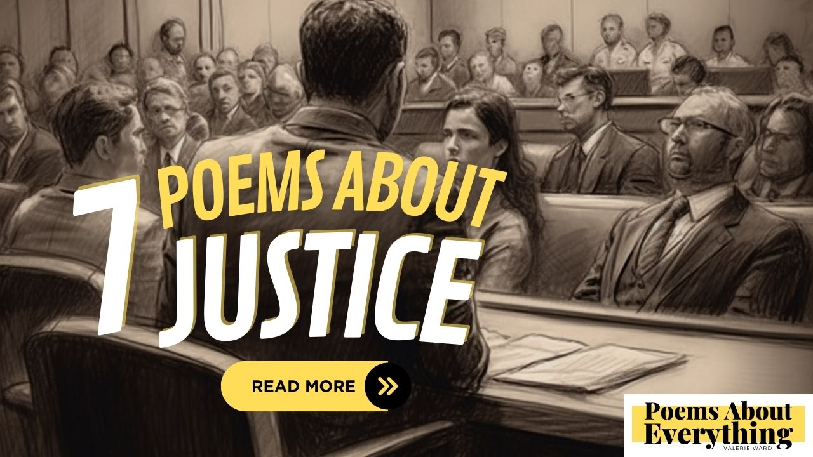

In the US, we are fortunate to have a [strong justice system](https://www.uscourts.gov/about-federal-courts/court-role-and-structure). Its aim is to maintain equality and fairness for all.

Justice is all about treating people with respect and fairness no matter their background. By seeing people as innocent until proven guilty we afford the opportunity to defend ourselves.

I try to get involved in as many local events/charities as I can. Sometimes it’s an open mic night such as the one I did lately where I shared a few of my poems about justice. Other times it’s volunteering at the local animal shelter.

As we all know, achieving justice for all is not always perfect. The system has failed many times in recent news and we must strive to do better. Let’s value our fellow man and achieve great things.

_affiliate links below_

## 7 Poems about justice
---------------------

There are multiple types of justice and through the years I've learned more about each. As I research and write more poems about justice, I learn more and more.  Let's start with a haiku about justice prevailing.

> Courts and laws prevail,  
> Balancing rights and wrongs true,  
> Justice shall prevail.

### A Poem about Lady Justice
-------------------------

Who is Lady Justice? She is a symbol of our legal system and is often seen holding a sword in one hand and scales in the other. The scales represent weighing out the evidence and equality. Her sword represents the strength of the law and the enforcement of justice.

She is almost always seen blindfolded to signify that justice is objective without considering one’s race, gender, social status, etc.

Lady Justice is a symbol from Greek mythology.  I really see myself in her as she upholds justice and I try to share a fresh perspective through my poems about justice.

> Lady Justice, strong and fair,  
> With scales in hand and flowing hair,  
> She stands tall, unwavering and true,  
> A symbol of justice for me and you.
> 
> Her sword is sharp, her scales are just,  
> She upholds the law with honor and trust,  
> She sees no color, no bias or creed,  
> Only truth and justice, in every deed.
> 
> Her blindfold is a testament to all,  
> That justice is blind, to great and small,  
> That every person, rich or poor,  
> Is equal under her watchful score.
> 
> Her stance is steady, her purpose clear,  
> To bring justice to those far and near,  
> To ensure that every voice is heard,  
> And every wrong is righted by her word.
> 
> So let us honor Lady Justice today,  
> And strive to live by her virtuous way,  
> For justice is the cornerstone of all,  
> And Lady Justice stands firm, proud and tall.

### A Poem about distributive justice
---------------------------------

What is distributive justice? This form of justice focuses on making sure all people have the resources they need to thrive. These typically include healthcare, employment, and education.

> Fairness, equity, and justice for all,  
> These are the values that we must recall,  
> When we think about a society that's just,  
> Where everyone has the chance to trust.
> 
> Distributive justice is the key,  
> To creating a world where we can all be free,  
> Free to learn, to grow, and to thrive,  
> Free to pursue our dreams and to survive.
> 
> Access to resources is essential,  
> For all to reach their full potential,  
> Education, healthcare, and employment too,  
> These are the things that we all pursue.
> 
> But when inequalities abound,  
> These resources are not equally found,  
> Some are left behind, excluded and denied,  
> Their dreams and hopes are pushed aside.
> 
> So let us work to make things right,  
> To end the struggle, to end the fight,  
> Let us strive to create a fairer world,  
> Where justice and equity are unfurled.
> 
> For when we work towards distributive justice,  
> We build a society that we can trust,  
> A society that is just and equitable,  
> A society that is truly formidable. 

### A Poem about retributive justice
--------------------------------

What is retributive justice? In its simplest terms, this form of justice is about penalties and punishment for crimes and other forms of wrongdoings.

> Retributive justice, it's the way,  
> To make sure crime doesn't pay,  
> Punishment for those who do wrong,  
> A consequence for actions that don't belong.
> 
> It's a system that we all need,  
> To ensure that justice is indeed,  
> Administered fairly, without prejudice,  
> Punishment proportionate, without malice.
> 
> But retribution alone is not enough,  
> To make society peaceful and tough,  
> We need preventative measures in place,  
> To address root causes and help those in a dark space.
> 
> A balance of justice, that's the key,  
> To ensure that we are all free,  
> Free from harm, free from fear,  
> A society that's just and clear.
> 
> So let us work towards a world,  
> Where justice is fair, where justice is unfurled,  
> A world where we can all be safe,  
> And justice serves its rightful place.

### A Poem about restorative justice
--------------------------------

What is restorative justice? Restorative justice primarily focuses on restoring the balance after wrongdoing. It promotes healing over punishment in most cases.  
Depending on the severity of the crime, this could be through mandatory community service, written apologies, and/or financial restitution.

Unfortunately, I have a real-life example of when I was in middle school and damaged the property of a business on the walk home from school. The police became involved and my school stepped in to talk to the owners of the business. In the end, I had to do community service for the business and write apologies to everyone involved.

Restorative justice isn’t always appropriate for all cases for sure, but I believe it is important as an alternative to the traditional “go to jail” approach when possible.

[Learn more with this book on restorative justice](https://amzn.to/3LqpynM).

> In a world of conflict, harm and strife,  
> We seek a way to heal and make right,  
> To repair the harm, to mend the wound,  
> A path towards peace, that can be found.
> 
> Restorative justice is the way,  
> A chance for all to have a say,  
> To listen and learn, to empathize,  
> To come together and humanize.
> 
> It's not just about punishment or blame,  
> But about taking responsibility for the pain,  
> And finding ways to make amends,  
> To rebuild relationships and make new friends.
> 
> It's about healing the hurt and the heart,  
> To find a way forward, to make a fresh start,  
> To build a community that's strong and connected,  
> Where forgiveness and healing are always respected.
> 
> So let us embrace this way of justice,  
> And work towards a world that's fair and just,  
> Where restorative justice is the norm,  
> And healing and reconciliation are born. 

### A Poem about procedural justice
-------------------------------

What is procedural justice? This comes down to the court system as a whole. We’ve all heard that you’re innocent until proven guilty and this procedural justice focuses on that.

You have the right to a fair trial, an attorney, a judge free of bias, and appeals.

Does it always work out fairly? Unfortunately not! But, because of these rights, people can appeal unfair trials for another fair trial with different people.

> Procedural justice, the cornerstone  
> Of fairness in every system's tone  
> Impartiality rules the day  
> And equal treatment in every way
> 
> It's not just the outcome that must be right  
> But how the process takes us to the light  
> Transparency, participation, and voice  
> Are fundamental in every choice
> 
> Procedural justice is not just for show  
> It's a moral imperative we must know  
> For every decision that we make  
> We must ensure the process is not opaque
> 
> Let's strive for procedural justice each day  
> And ensure fairness guides our every way.

### A Poem about social justice
---------------------------

What is social justice? Social justice is about all people having equal rights, period! Justice and your rights shouldn’t be influenced by your upbringing, status, race, color, identity, etc.

It allows us to stand up for what we believe in to create a country that is more fair, compassionate, and just for everyone. I believe we all fundamentally want this.

> There once was a quest for justice,  
> Amidst the world's societal fuss,  
> With fairness in sight,  
> And wrongs to right,  
> We marched forward, hopeful and just.
> 
> From the streets to the halls of power,  
> The movement grew stronger by the hour,  
> Voices raised high,  
> In the fight for what's right,  
> For equal rights, we never tire.
> 
> We speak for those who can't be heard,  
> And stand for those who've been deterred,  
> We fight for the poor,  
> And those who need more,  
> Our mission remains, undeterred.
> 
> We won't rest until all are free,  
> From the shackles of inequality,  
> Till justice prevails,  
> And love never fails,  
> We'll keep on, tirelessly.
> 
> So let us raise our voices high,  
> And fight for justice, till we die,  
> For social justice, we stand,  
> Together, hand in hand,  
> Till every heart beats equally.

### Hitting the Gavel (In Summary)
------------------------------

When a judge hits the gavel it is a call to attention. In summary, I hope this post of my favorite poems about justice calls to your attention a little more about our justice system. It is our duty as citizens to educate ourselves on these different types of justice and hope they operate together and within our society.

Let’s also recognize that there is always room for improvement when creating a fair and just country. If you so choose, get involved on the local level with social justice programs. At the very least let’s practice respect and fairness towards others.