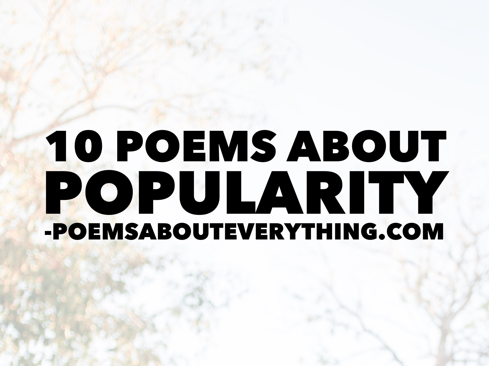

Popularity is a concept that is introduced to us at a young age and seems to follow us throughout life whether we strive for it or not. From [Shakespeare](https://www.shakespeare.org.uk/explore-shakespeare/shakespedia/william-shakespeare/william-shakespeare-biography/) to modern-day Instagram influencers, the allure of being popular has remained constant.

In this blog post, we will dive into the pros and cons of popularity and feature poems about popularity for each of them.  Whether you're a social butterfly or an introvert, these poems about popularity are sure to resonate with you and provide insight into the ever-shifting dynamics of popularity.

## Poems about Popularity focusing on the UPSIDE of being popular
--------------------------------------------------------------

### Social status

Being popular often means that you have a higher social status among your peers, which can lead to greater social opportunities, such as being invited to exclusive events or parties.

> Being popular, it's a sought-after prize, A symbol of status in others' eyes, A measure of worth that's hard to ignore, A badge of honor that's worth fighting for.
> 
> It means being invited to the best of events, The most exclusive parties and social events, Being welcomed with open arms and a smile, And being the one that everyone wants to style.
> 
> It's an enviable position, a place of power, Where you can make things happen in any hour, And influence those around you with ease, While enjoying life with effortless breeze.
> 
> But being popular is not always a bed of roses, It can be lonely and full of opposing forces, It's a constant battle to maintain the facade, And keep up appearances while ignoring the flaws.
> 
> It's a world of judgment, of constant scrutiny, Where your every move is under scrutiny, And jealousy and resentment are always in sight, While you try to keep your position in the limelight.
> 
> So while being popular may seem like the key, To a life of joy, of happiness, and glee, Remember that it's just a fleeting goal, And that true happiness comes from within the soul.

### Increased influence

When I first started writing poems about popularity, the increase in influence was the first thing that came to mind. People who are popular tend to have more influence over others. This can be beneficial in both personal and professional situations.

> Popularity brings with it a certain might, A power to influence, to lead, to excite, To shape opinions and sway the masses, And to bring about change with the slightest of passes.
> 
> It's a gift and a curse, a double-edged sword, A tool that can be wielded for good or discord, A force to be reckoned with in every way, That can take you to heights you've never seen before today.
> 
> With influence comes responsibility, it's true, A duty to use your power wisely, through and through, To guide and inspire those around you, And to lead by example in all that you do.
> 
> Whether in personal or professional spheres, Your influence can open doors and dry tears, It can light the way and lift people up, Or bring them down with just a word or a touch.
> 
> So use your influence with caution and care, And let your words and actions reflect what's fair, For in the end, it's not just popularity you seek, But the legacy of kindness and empathy you'll leave.

### Wide social network

Popular people tend to have a wider social network, which can lead to more opportunities for socializing, networking, and making new friends. Poems about popularity when it comes to increasing your social circle of friends are hard to come by, this one is my favorite.

> Popular people have a gift you see, A wide social network, a community, A group of friends that stretches far and wide, With opportunities and experiences by their side.
> 
> Their world is open, their horizons broad, With so many connections, new paths to be trod, A universe of people, cultures, and ideas, A world that's open and free from all fears.
> 
> They revel in the company of others, Sharing stories and laughter like sisters and brothers, Breaking bread with friends both old and new, Sharing life's moments in a way that is true.
> 
> Their social network is a treasure trove, Full of people that love and truly care, Offering support, guidance, and hope, When life's struggles seem too much to bear.
> 
> So if you're looking for new friends and connections, Look to the popular ones, with their wide intersections, Their social networks are vast and full of life, A place where friendships flourish and happiness thrives.

### More attention

Popularity often comes with a lot of attention, which can be flattering and make you feel good about yourself.

> Popularity brings with it a certain allure,  
> A spotlight on you, so bright and so pure,  
> A gaze that follows you wherever you go,  
> With eyes that are admiring, and hearts all aglow.
> 
> It's a feeling that's heady, and hard to ignore,  
> A warmth that spreads through you, to your very core,  
> A sense of pride and self-esteem that's boosted,  
> A feeling of worth that can never be muted.
> 
> The attention is addictive, it's true,  
> A rush of adrenaline that pulls you through,  
> A feeling of being special, of being unique,  
> A sense of belonging that's beyond critique.
> 
> It's not just the numbers, the likes, and the views,  
> It's the comments, the feedback, the positive news,  
> It's the validation that comes from being seen,  
> And the sense of fulfillment that it brings to the scene.
> 
> So if you find yourself in the public eye,  
> Enjoy the attention, don't be shy,  
> Let it fill you up, let it make you whole,  
> Let it lift you up, let it touch your soul.

### Boosted confidence

Being popular can boost your self-esteem and confidence, as it suggests that others admire and respect you.

> Popularity has a way of lifting us high, Of making us feel like we can touch the sky, It boosts our confidence and self-esteem, And makes us believe in our wildest dreams.
> 
> It's a feeling of validation, of being seen, Of being admired, respected, and esteemed, It's a sign that we're doing something right, And that our efforts are worth the fight.
> 
> The confidence that comes with popularity, Is like a beacon, a light in the sea, A guiding force that leads us on, And helps us to stand tall and strong.
> 
> It's a power that comes from within, A sense of self-worth that never dims, It's a belief that we can conquer all, And rise above every obstacle and fall.
> 
> So if you find yourself in the popular sphere, Let the confidence that comes with it be your cheer, Let it guide you, inspire you, and set you free, To be the best version of yourself that you can be.

Poems about Popularity focusing on the DOWNSIDE of being popular
----------------------------------------------------------------

Pressure to maintain image: Being popular can come with the pressure to maintain a certain image, which can be stressful and exhausting.

### Constant scrutiny

Popular people often face more scrutiny and criticism from others, which can be hurtful and damaging to their self-esteem.

> Under the watchful eye of many, I find myself under constant scrutiny. Every move, every word, every action, Is analyzed and judged with extreme caution.
> 
> Popular they call me, a name I wear with pride, But the pressure that comes with it, I cannot hide. Criticism and scrutiny follow me everywhere, A burden that I carry, a weight that's hard to bear.
> 
> Every step I take is met with a critical eye, And every mistake I make is amplified in the public eye. It's hard to keep my head up, to stay strong, When every little flaw is highlighted for so long.
> 
> I wonder if they see me as a human being, With emotions and feelings that need tending. Or if I'm just a product, a figure to be consumed, A source of entertainment, a commodity that's presumed.
> 
> But despite the constant scrutiny, I refuse to break, For I am more than just a name or a face. I am a person with dreams and aspirations, And I won't let the opinions of others hinder my determination.
> 
> So I'll keep walking forward, one step at a time, And I'll keep striving for a life that's truly mine. For though the scrutiny may never fade, I am more than what they see, I am not just a charade.

### Difficulty trusting others

Popular people may have a hard time trusting others, as they may not know whether people like them for who they are or for their popularity.

> I walk through life with caution in my heart,  
> For I have learned that trust can easily depart.  
> My popularity draws many to my side,  
> But how many truly want to be my guide?
> 
> I often wonder if they like me for me,  
> Or if they just want a taste of popularity.  
> Do they see beyond the fame and the glory,  
> To the person who's flawed, who's far from perfect and holy?
> 
> It's hard to trust when everyone's a friend,  
> And every smile seems to have a hidden end.  
> The fear of betrayal looms like a shadow,  
> And I can't help but wonder who to follow.
> 
> But I know I cannot live my life in fear,  
> For trust is a vital part of life, that's clear.  
> So I take a deep breath and open my heart,  
> Hoping that someday, trust won't feel so far apart.
> 
> I start with those who've been there all along,  
> The ones who never cared if I was right or wrong.  
> I let them in, bit by bit, and slowly see,  
> That trust can be built, but it takes time to guarantee.
> 
> And as I learn to trust, my heart begins to grow,  
> For I know that I don't have to face life alone.  
> It's a risk worth taking, to open up and share,  
> For the rewards of trust are beyond compare.
> 
> So I choose to trust, even when it's hard,  
> For I know that true friendships are a reward.  
> And though I may stumble and fall along the way,  
> I'll keep trusting, for it's worth it at the end of the day.

### Jealousy and resentment

Being popular can also lead to jealousy and resentment from others who may feel left out or excluded from social circles.

> Jealousy and resentment, emotions so raw, Can be felt by those left out of the social draw. For popularity breeds a sense of exclusion, And those left behind may feel like an illusion.
> 
> It's hard to see others shine so bright, When you feel like you're lost in the night. The envy and resentment can consume the soul, And it's hard to let go, to relinquish control.
> 
> But jealousy and resentment, they only bring pain, A toxic cycle that's hard to break and sustain. For every moment spent in envy and spite, Is a moment wasted, a moment out of sight.
> 
> It's hard to rise above, to let go of the hate, To see beyond the surface and appreciate. But if we take a moment to reflect and see, We'll find that popularity is not all it's meant to be.
> 
> For popularity can be a lonely road, A path that's hard to navigate and behold. The pressure and the scrutiny can take their toll, And those who seem so strong may have a fragile soul.
> 
> So let's not be consumed by jealousy and hate, Let's rise above and appreciate. For we all have something unique to offer, And our worth is not defined by popularity's swagger.
> 
> Let's celebrate each other's strengths and flaws, And remember that we all have our own unique cause. For in the end, it's not popularity that defines us, It's the love and kindness that we bring, it's what unites us.

### Risk of losing popularity

Popularity is often fleeting, and popular people run the risk of losing their status if they make a mistake or fall out of favor with others.

> Popularity is a fickle flame, One that can flicker and fade without a name. It's easy to bask in its warm embrace, But the risk of losing it can be hard to face.
> 
> One mistake, one misstep, and it can all come undone, Leaving you alone, in the cold, with nowhere to run. The fear of losing it all can consume the mind, And it's hard to find solace, to leave it all behind.
> 
> But popularity, it's not all that we are, It's just a fleeting moment, a passing star. For who we are, it's more than just a name, It's the love we give, the light we bring, it's the game.
> 
> We all make mistakes, it's just a part of life, But it's not the end of the world, it's not the knife. For every stumble, there's a chance to rise, To learn from the past, to see beyond the lies.
> 
> So don't be afraid to take risks, to make a change, For popularity's worth, it's not worth the range. The risk of losing it, it's just a fleeting thought, For what truly matters, it's the love we brought.
> 
> In the end, it's not popularity that defines us, It's the impact we make, the love we trust. So let's not be afraid to take a leap of faith, For what we truly are, it's more than just a race.

In conclusion, the demand for poems about popularity is a "popular" one and we hope these words have helped you in some way.  While it is natural for us to desire attention and recognition, it is important to remember that popularity is not the sole measure of our worth.

At the end of the day, what truly matters is staying true to ourselves and being content with the choices we make. Whether you are popular or not, strive to cultivate meaningful connections and pursue your passions with enthusiasm. 

Speaking of Popular Poems, these are the most popular poetry books.
-------------------------------------------------------------------

_Affiliate Links Below_

1.  [Where the Sidewalk Ends: Poems and Drawings](https://amzn.to/3KE7cy5)
2.  [150 Most Famous Poems](https://amzn.to/3olqosT)
3.  [Call Us What We Carry: Poems](https://amzn.to/41d8Xt4)
4.  [Pillow Thoughts](https://amzn.to/3mH1zav)
5.  [Things We Don't Talk About](https://amzn.to/41sf6C9)
6.  [healing for no one but me](https://amzn.to/41d9gUK)

I leave you with this _feel-good_ haiku about popularity.

> Popularity soars,  
> Friendship blossoms, smiles abound,  
> Heart swells with joy found.