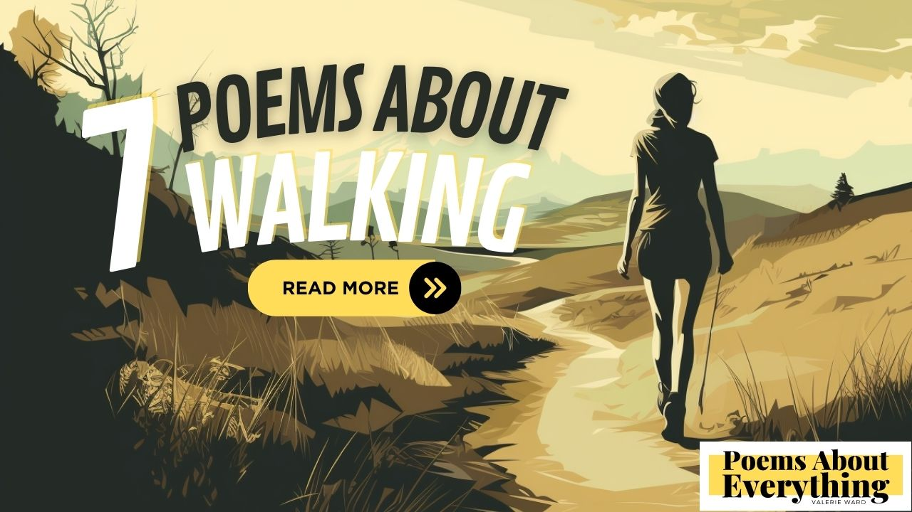

I absolutely love walking each morning! I enjoy the fresh air filling my lungs and the gentle breeze on my skin. It serves as a moment of quiet reflection before the hustle and bustle of my day begins. I take in my surroundings—the chirping birds, the rustling leaves, the soft glow of the rising sun—and it all feels like a gift.

## A few of my favorite poems about walking
----------------------------------------

Through the years I have written a few poems about walking. These are my favorites!  I must admit that poem #6 "Just Start Walking" was the hardest one for me to write.  It is a saying that my best friend and I always said to each other for encouragement.  She later passed away due to skin cancer.

### "New Morning Steps" - A peaceful morning walk poem
--------------------------------------------------

> As the sun begins to rise,  
> And the world awakens from the night,  
> I take a peaceful morning walk,  
> And bask in nature's quiet delight.
> 
> The birds are chirping in the trees,  
> Their melodies fill the air,  
> And the rustling of the leaves,  
> Provides a soothing background to the scene so fair.
> 
> The grass beneath my feet is cool,  
> And the morning dew still lingers,  
> As I stroll along the path,  
> And breathe in the freshness with my fingers.
> 
> The world is still asleep,  
> But I am wide awake,  
> Embracing the tranquility,  
> And the stillness that the morning brings, I take.
> 
> I revel in the beauty,  
> Of the world around me,  
> And I feel my worries fade away,  
> As I walk in perfect harmony.
> 
> And so I cherish these moments,  
> Of peaceful morning walks,  
> For they remind me of life's simple joys,  
> And the beauty that surrounds us all.

[Home of American Golf](https://www.homeofgolf.com/) in NC made a short video with my poem.

### "Let's Go for a Walk" - A poem about walking with my dogs!
----------------------------------------------------------

> When I say "let's go for a walk,"  
> My dogs' tails start to wag and talk,  
> Their eyes light up with eager glee,  
> As they jump up and down, ready to be free.
> 
> I grab their leashes, and off we go,  
> Walking down the street, nice and slow,  
> Sniffing here and there, marking their spots,  
> My furry companions enjoying their trot.
> 
> They love to explore and take in the sights,  
> Chasing after squirrels with all their might,  
> Stopping to smell the flowers and trees,  
> As we stroll along with the gentle breeze.
> 
> Their tongues hang out, panting with joy,  
> As we walk together, my little girl and boy,  
> And when we're done and back at the door,  
> They give me a look that says, "let's do it once more!"
> 
> Walking the dogs is such a treat,  
> Their happiness and wagging tails are sweet,  
> It's a simple pleasure, but one I adore,  
> Going for a walk with my furry friends, forevermore.

### "Strolling Sunsets" - A poem about walking with a spouse at sunset
------------------------------------------------------------------

> As the sun sets low in the sky,  
> I take my darling by the hand,  
> And we stroll through fields awry,  
> In a world so quiet and grand.
> 
> We walk along a winding path,  
> As night birds sing a lullaby,  
> The gentle breeze of evening hath,  
> A peaceful calm that cannot lie.
> 
> My love and I, side by side,  
> We share this moment so serene,  
> Our hearts beating as one, no divide,  
> A blissful sight, this tranquil scene.
> 
> As the sky turns into twilight,  
> The stars above start to shine,  
> Our love, a shining beacon of light,  
> In this world so vast, so divine.
> 
> We stop beneath a tree so tall,  
> And hold each other oh so tight,  
> Whispers of love we do recall,  
> Our love a fire, an eternal light.
> 
> And as we walk back home so slow,  
> Our hearts filled with warmth and love,  
> Our evening stroll a memory to glow,  
> A moment in time, so pure, thereof.

### "Traveling Tourist" - A poem about my time touring New York
-----------------------------------------------------------

> Amidst the hustle and bustle of the city's roar,  
> A tourist wanders, seeking to explore.  
> Tall buildings loom above with grandeur and might,  
> As if reaching towards the sky, a magnificent sight.
> 
> With a map in hand and an adventurous heart,  
> The tourist sets out to discover every part.  
> The streets are busy with people on the go,  
> Each with a destination, a place to show.
> 
> The city never sleeps, it's alive all day,  
> The tourist can't help but feel swept away.  
> From the towering skyscrapers to the quaint little shops,  
> There's something new to see around every block.
> 
> The city's energy is infectious, it's true,  
> And the tourist can't help but feel it too.  
> As they wander and explore with eager eyes,  
> Their spirit soars, reaching towards the skies.
> 
> The city's secrets slowly unfold,  
> Revealing hidden treasures, new stories to be told.  
> From the grand museums to the bustling cafes,  
> There's adventure waiting around every maze.
> 
> As the sun sets and the day winds down,  
> The tourist can't help but wear a grin, never a frown.  
> For they've explored a city full of life and light,  
> And their heart is now filled with memories, oh so bright.

### "Navigating the World of Life" - A poem about walking through life and trying to figure it out
----------------------------------------------------------------------------------------------

> A nomad wanders through the land,  
> With nothing but his thoughts at hand,  
> He walks and walks, day and night,  
> Trying to make sense of this world's plight.
> 
> He travels far, he travels wide,  
> Through mountains high and valleys wide,  
> He meets new people, hears their stories,  
> And learns from them about life's glories.
> 
> He ponders on the mysteries of life,  
> Why we are here, what's our strife,  
> He wonders about the purpose of his own,  
> And where his journey will take him alone.
> 
> He marvels at the beauty of nature,  
> And the power of its every creature,  
> He sees the stars shining bright,  
> And the moon casting its ethereal light.
> 
> He walks through deserts, through snow and rain,  
> Through forests dense and grassy plain,  
> He never stops, he never rests,  
> For he knows his journey is a test.
> 
> He knows that life is a winding road,  
> With many twists and turns untold,  
> But he embraces it with open arms,  
> And walks with courage, amidst life's harms.
> 
> For he knows that in the end,  
> Life is a journey to comprehend,  
> And with every step that he takes,  
> He learns more about the world's fakes.
> 
> So the nomad walks on and on,  
> Through this world's chaos and con,  
> With a heart full of hope and love,  
> And a mind that soars like a dove.

### "Just Start Walking" - A poem about walking with my best friend who passed away
-------------------------------------------------------------------------------

> Two lifelong friends, no map in hand,  
> Set out to walk across the land,  
> With no end in sight, no final goal,  
> Just a path to follow, heart and soul.
> 
> They stepped together, side by side,  
> With nothing to fear and nothing to hide,  
> Each step a beat, a rhythmic stride,  
> With nothing to do but enjoy the ride.
> 
> They walked through fields of gold and green,  
> And over hills, so vast and serene,  
> They walked through rain and walked through sun,  
> Two friends on a journey, just begun.
> 
> They talked and laughed, and shared their dreams,  
> As they walked along, by crystal streams,  
> They walked through forests, dense and deep,  
> With promises to each other to always keep.
> 
> Their journey took them far and wide,  
> Through valleys low, and mountains high,  
> Their footsteps marked the path they trod,  
> A journey shared, a bond made strong.
> 
> And then one day, they saw the light,  
> A destination, shining bright,  
> They reached the end of their long walk,  
> And found a place where they could talk.
> 
> A place of beauty, beyond compare,  
> A place of peace, a place to share,  
> They looked at each other, with tears in their eyes,  
> And knew that their friendship would never die.
> 
> For though their journey had reached its end,  
> Their love for each other would always mend,  
> And so they stood, through life's demand,  
> Two lifelong friends, together, grand.
> 
> And as they gazed upon that wondrous sight,  
> They knew that everything was right,  
> For though they had started with no end in sight,  
> They had ended up, in the perfect light.

### "Quick Steps" - A brief haiku about walking
-------------------------------------------

> Amidst nature's grace,  
> Footsteps tread upon the earth,  
> Walking brings peace home.

### 5 Benefits of Walking
----------------------

Now that you've enjoyed some poems about walking, let me tell you a few of the reasons why I enjoy daily walks.  Maybe this will encourage you to take your first step.

1.  Easy-ish Exercise: I say it's "easy-ish" because while simple to do, it can be hard to get motivated at times.  However, walking is an excellent form of low-impact exercise that can [help improve cardiovascular health](https://www.heart.org/en/news/2022/04/06/walking-your-way-to-better-health-remember-the-acronym-fit), strengthen muscles, and burn calories.
2.  Mental health benefits: I've noticed a huge difference in my stress and anxiety levels when walking.  I also credit it to improving my mood and focusing my thoughts.  Many of my poem topics arise from these walks.
3.  Social steps: I love walking with my friends, family, or pets because it's a chance to connect with others and enjoy their company. It's a great way to spend quality time together without distractions.
4.  Nature walks: One of my favorite things about walking is being able to appreciate the beauty of nature. Whether it's a park, beach, city, or my own subdivision, being outside and enjoying the scenery is so refreshing and uplifting.
5.  Cheaper than a gym membership: Walking is a low-cost form of exercise that doesn't require any special equipment or gym memberships. All I need is a comfortable pair of shoes and I'm ready to go!

If you haven't added walking to your daily life, I highly encourage you to do it!  If you enjoy reading as much as I do, here are a few books about walking you may enjoy.

_affiliate links_

1. [100 Hikes of a Lifetime](https://amzn.to/3L5dNTB)
2. [Walking Your Way to Weight Loss](https://amzn.to/3MPcA4k)
3. [52 Ways to Walk: The Surprising Science of Walking for Wellness and Joy, One Week at a Time](https://amzn.to/41dujH2)
4. Wanderers: [A History of Women Walking](https://amzn.to/40dlYld)