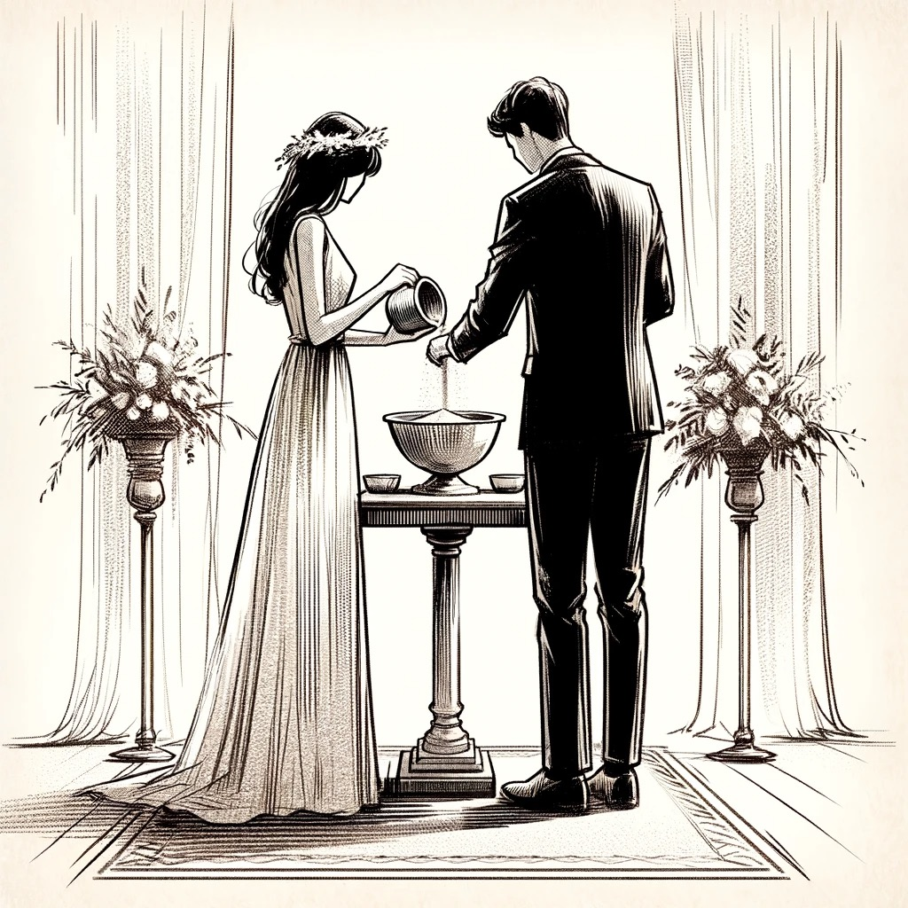

Within every important ritual, there is a sign, an action that quietly but deeply expresses the true meaning of the event. The sand ceremony is particularly notable as it presents a striking visual metaphor; it's like colors and particles moving together to represent coming together, affection, and lives merging.

> Grains blend, hearts unite,  
> Two colors merge into one,  
> Love's eternal dance.

### What is a Sand Ceremony?

Picture two distinct glass bottles filled with sand, each one a different color that shows the personal paths, relatives, and various life events of two people. They are next to each other, encircled by family warmth and nature's soft hold as they combine their sands into one container.

### What does a sand ceremony symbolize?
------------------------------------

This act, simple in its execution but rich in meaning, symbolizes the coming together of their separate paths into one shared journey. The intertwined layers of sand, now inseparable, speak to a commitment that is deep and enduring.

The sand ceremony, often a part of wedding rituals but also meaningful in other types of unions and celebrations, transcends the mere act of mixing grains of sand. It's a vivid portrayal of life's tapestry, a reminder that when separate lives blend, they create something more beautiful and complex than any single grain.

In this ceremony, each grain of sand is a promise of togetherness, a promise that signifies strength, unity, and an unbreakable bond. It's a ceremony that speaks to the heart, much like poetry, resonating with the rhythm of our shared human experiences.

As we delve into the world of sand ceremonies, let's explore the depths of its symbolism, the words that give voice to its unspoken promise, and the alternatives that echo its sentiment. For in understanding this ceremony, we understand a little more about love, commitment, and the beautiful complexity of our human connections.

### My personal story of the first sand ceremony I witnessed
--------------------------------------------------------

During a warm summer in Tennessee, I had my first encounter with a sand ceremony. It was at the wedding of a dear college friend, held in a quaint chapel nestled among the Smokies. The air was thick with the scent of wildflowers, and the sun cast a golden hue as if blessing the day with its warmth.

As the ceremony commenced, my attention was drawn to two small, ornate vials placed tenderly on a table adorned with lace and wild roses. Individual containers contained sand of a different color – one, a deep, earthy brown, and the other, a vibrant blue.

When the moment came, the bride and groom, hands slightly trembling with the weight of the occasion, poured their sand into a single, larger vase. The sands flowed together, creating a dance of colors and shapes, a new pattern emerging with each grain. It was as if I was watching a story being written, not with ink, but with bits of the earth itself.

The impact was profound and unexpected. As an aspiring poet, I’ve always been drawn to metaphors, to finding the deeper meaning in everyday occurrences. In that blending of sands, I saw more than just an emblem of unity; I saw a reflection of life itself. The separate colors maintained their individuality, yet together they formed something new and beautiful, much like the verses of a poem coming together to create a profound narrative.

This ceremony, so simple in its execution, spoke to me of the delicate balance between maintaining one’s identity and merging with another in partnership. It resonated with the part of me that always seeks to find harmony between the rolling hills of my past and the vast skies of my present.

In that moment, I understood that each of us carries our own vial of sand, our own stories and experiences. And when we choose to share our lives with another, we don’t lose ourselves; instead, we create a new, exquisite mosaic that honors both the individual and the union.

From that day, I carried the image of the blending sands with me, letting it seep into my writing and my reflections on life. It was a poignant reminder that in love, as in poetry, there is beauty in the confluence of different worlds.

## 5 Sand Ceremony Poems
---------------------

Below you will find a collection of my poems inspired by the beautiful tradition of sand ceremonies. Each piece is crafted with love and the hope that it resonates with the unique journey of your union. Feel free to read them at your wedding, and may they add an extra layer of meaning and beauty to your special day.

### "Merging Sands, Merging Hearts"
-------------------------------

This poem "Merging Sands, Merging Hearts" encapsulates the essence of a sand ceremony, focusing on the theme of unity and the merging of individual lives into one harmonious existence.

> In a vessel of dreams, under a canopy of love,  
> We pour our sands, a testament from above.  
> Your grains, my grains, in individual colors bright,  
> Merge in a dance, a captivating sight.
> 
> A journey of souls, once separate, now entwined,  
> Each grain, a story, a memory defined.  
> In this sacred space, where two paths become one,  
> The art of our love is beautifully spun.
> 
> Our individual colors, in their uniqueness, shine,  
> Yet together, create a new design.  
> A symbol of unity, of hearts forever entwined,  
> In this blend, our destinies are lovingly confined.
> 
> Like the sands, we flow, in harmony and grace,  
> Building a future in this shared space.  
> Merging sands, merging hearts, in a display so divine,  
> In this moment, our lives beautifully intertwine.

### "Unyielding Union"
------------------

This poem emphasizes the strength and unity symbolized by the blending of sands in a ceremony, portraying the enduring nature of love in the face of life's challenges.

> In separate containers, we began,  
> Holding grains of hopes, dreams, and life's span.  
> Your essence, my spirit, in vessels apart,  
> Awaiting the moment to blend heart to heart.
> 
> With gentle hands, we pour and unite,  
> Our sands merge in the morning light.  
> A cascade of colors, a vibrant display,  
> Symbolizing our love's unbreakable sway.
> 
> Together they blend, inseparable now,  
> A union of souls, an unspoken vow.  
> No wave of adversity can tear them asunder,  
> Nor the world's wonder or roar of thunder.
> 
> In this glass, our love, a fortress so grand,  
> Withstanding life's storms, hand in hand.  
> For though the tides may rise and try to divide,  
> Our unified sands will always abide.
> 
> In this sacred vessel, our love's testimony,  
> A symbol of unity, strong and homely.  
> Through trials and triumphs, our love shall stand,  
> Eternally held in this glass of sand.

### Short Sand Ceremony
-------------------

This limerick captures the joy and unity of a sand ceremony in a playful and light-hearted manner.

> In a vase where two sands did meet,  
> A couple made their love complete.  
> With grains of gold and blue,  
> They formed a view so true,  
> In a blend that no storm could defeat.

### Sonnet of Sands
---------------

This sonnet embraces the romantic symbolism of a sand ceremony, portraying the enduring and inseparable nature of the couple's love.

> In vessels once apart, our sands did lie,  
> Each grain a chapter of our solo tales.  
> But here beneath the vast, embracing sky,  
> We pour our hearts where true love never fails.
> 
> Together now, in this glass firm and clear,  
> Our separate hues in harmony combine.  
> In every grain, our whispered dreams appear,  
> In this union, our destinies entwine.
> 
> No earthly force can part these sands so merged  
> In love's strong grasp, forevermore they're sealed  
> Against time's tide, our souls in union surge  
> Within this blend, an eternal bond revealed
> 
> For in this dance of sands, so finely twined,  
> Our love, once joined, no fate can ever unwind.

### Harmony in Love's Journey
-------------------------

This couplet poem encapsulates the beauty and unity of a couple coming together in marriage, highlighting their journey, love, and enduring commitment. I specifically love this poem since a complete style poem is written two lines at a time that are in sync with each other, much like two people becoming one.

> In unity, two hearts now beat as one, a bond so fair and sage,  
> Together they step, in harmony, embarking on life's grandest stage.
> 
> With vows exchanged and rings that gleam, their love sets the night aglow,  
> In each other's gaze, they find their dreams, in marriage's tender flow.
> 
> As rivers meet and blend as streams, so do their souls entwine,  
> In every laugh, hope, and dream, their destinies align.
> 
> Through seasons of joy and trials alike, their union stands steadfast and true,  
> In each other's arms, they find the light, a love forever anew.
> 
> So here they stand, united and strong, a testament to love's enduring song,  
> In marriage's dance, they gracefully belong, together where they've yearned all along.

### 12 Sand Ceremony Alternatives

In recent years, the sand ceremony has seen a surge in popularity at weddings, captivating couples with its visual beauty and symbolic representation of unity. This poignant ritual, however, is just one of many creative ways to symbolize the blending of two lives.

As diverse as the couples themselves, alternatives like candle lighting, tree planting, and water blending ceremonies offer a range of options to suit different personalities, themes, and settings. Whether you're drawn to the traditional or the unconventional, there's a wealth of choices available, ensuring that your ceremony can be as unique and meaningful as your own love story.

1.  **Candle Lighting Ceremony**: Involves lighting a single candle from two individual candles, symbolizing the union of two lives into one. This ceremony is particularly poignant at evening or indoor weddings.
2.  **Tree Planting Ceremony**: The couple plants a tree together, symbolizing the growth and nurturing required in a relationship. This is a wonderful choice for nature lovers or outdoor weddings.
3.  **Water Blending Ceremony**: Similar to the sand ceremony, but using two different colors of water. This can be visually stunning and symbolizes the fluid and merging nature of their relationship.
4.  **Handfasting Ceremony**: An ancient Celtic tradition where the couple's hands are tied together with a cord or ribbon, symbolizing their connection and devotion.
5.  **Wine Pouring Ceremony**: Each person pours a glass of wine into a single cup and then drinks from it, symbolizing the blending of their lives. This can also be adapted with other beverages.
6.  **Love Letter Box Ceremony**: The couple places love letters to each other in a box with a bottle of wine and seals it, to be opened on a future anniversary.
7.  **Flower Ceremony**: Each partner exchanges a flower, or guests may contribute flowers to create a bouquet, representing the coming together of friends and family.
8.  **Ring Warming Ceremony**: Before the receiving of rings, wedding rings are passed around to guests before the vows, each person holding them briefly to imbue them with their well wishes.
9.  **Unity Puzzle Ceremony**: The couple assembles a puzzle, symbolizing the joining of their two separate lives into one complete picture.
10.  **Stone Ceremony**: Guests and the couple hold stones during the ceremony, imbuing them with good thoughts, then placing them in a container as a keepsake.
11.  **Butterfly Release**: The release of butterflies after the vows, symbolizes new beginnings and the transformation of love.
12.  **Unity Canvas Painting**: The couple paints a canvas together during the ceremony, symbolizing their collaborative and creative journey in marriage.